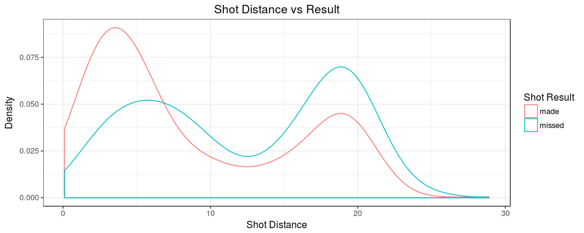
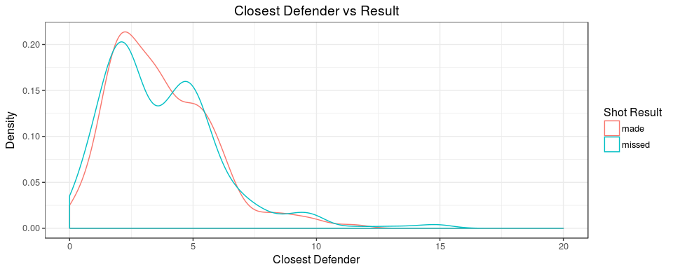
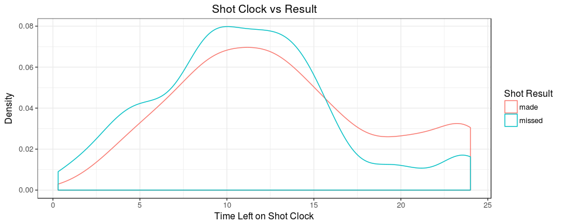

NBA Shot Prediction
================
Ryan Rozema
10 July, 2017

Introduction
============

The dataset that we will be studying shots taken by NBA player Anthony Davis.

This is a relatively large dataset. As stated in the introduction, it has over 120,000 instances but it also has 21 attributes. Because we are only looking at Anthony Davis's shots, we were able to cut the data down to just under 900 instances. Some of the attributes that are in this dataset we won't worry too much about because they aren't as important to predicting a shot in my opinion. Some of the attributes we will be working with are as follows:
1. **Location**: This is a binary attribute that is denoted by n **"A"** for an away game and a **"H"** for a home game.
2. **Final Margin**: This is a continuous attribute that tells us the difference in the score between the home team and the away team.
3. **Shot Number**: This is a continuous attribute that tells us how many shots that player has taken, including the one that they just shot.
4. **Period**: This is a categorical attribute that tells us what period of the game the player was in when they took the shot.
5. **Game Clock**: This is a continuous attribute that tells us how much time was left in the game when the shot was taken.
6. **Shot Clock**: This is a continuous attribute that tells us how much time was left in the current shot clock when the shot was taken.
7. **Shot Distance**: This is a continuious attribute that tels us the distance between the player and the baseket.
8. **Closest Defender Distance**: This is a continuous attribute that tells us the distance between the shooter and the closest defender.
9. **Shot Result - Classifier**: This is a binary attribute that will state whether the shot was made or missed by the player.

Data Preparation
================

This shows all of the summary data points for each column of the data set. This will be useful for quick reference later on in the document.

    ##     GAME_ID                               MATCHUP    LOCATION W      
    ##  Min.   :21400001   MAR 04, 2015 - NOP vs. DET: 30   A:455    L:376  
    ##  1st Qu.:21400192   DEC 27, 2014 - NOP @ CHI  : 24   H:386    W:465  
    ##  Median :21400408   JAN 07, 2015 - NOP @ CHA  : 24                   
    ##  Mean   :21400412   FEB 02, 2015 - NOP vs. ATL: 23                   
    ##  3rd Qu.:21400632   FEB 06, 2015 - NOP @ OKC  : 23                   
    ##  Max.   :21400903   JAN 12, 2015 - NOP @ BOS  : 23                   
    ##                     (Other)                   :694                   
    ##   FINAL_MARGIN       SHOT_NUMBER         PERIOD       GAME_CLOCK 
    ##  Min.   :-35.0000   Min.   : 1.000   Min.   :1.00   0:00   :  6  
    ##  1st Qu.: -8.0000   1st Qu.: 5.000   1st Qu.:1.00   0:03   :  5  
    ##  Median :  3.0000   Median : 9.000   Median :2.00   3:51   :  5  
    ##  Mean   :  0.9108   Mean   : 9.763   Mean   :2.37   5:42   :  5  
    ##  3rd Qu.:  9.0000   3rd Qu.:14.000   3rd Qu.:3.00   7:06   :  5  
    ##  Max.   : 48.0000   Max.   :30.000   Max.   :5.00   9:49   :  5  
    ##                                                     (Other):810  
    ##    SHOT_CLOCK        DRIBBLES        TOUCH_TIME      SHOT_DIST    
    ##  Min.   : 0.300   Min.   :0.0000   Min.   :-9.80   Min.   : 0.10  
    ##  1st Qu.: 8.375   1st Qu.:0.0000   1st Qu.: 0.80   1st Qu.: 3.90  
    ##  Median :11.800   Median :0.0000   Median : 1.10   Median : 8.40  
    ##  Mean   :12.202   Mean   :0.5422   Mean   : 1.88   Mean   :10.41  
    ##  3rd Qu.:15.300   3rd Qu.:1.0000   3rd Qu.: 2.60   3rd Qu.:17.90  
    ##  Max.   :24.000   Max.   :8.0000   Max.   :19.30   Max.   :28.90  
    ##  NA's   :33                                                       
    ##     PTS_TYPE     SHOT_RESULT         CLOSEST_DEFENDER
    ##  Min.   :2.000   made  :457   Adams, Steven  : 25    
    ##  1st Qu.:2.000   missed:384   Monroe, Greg   : 24    
    ##  Median :2.000                Chandler, Tyson: 22    
    ##  Mean   :2.011                Ibaka, Serge   : 22    
    ##  3rd Qu.:2.000                Noah, Joakim   : 19    
    ##  Max.   :3.000                Hill, Jordan   : 18    
    ##                               (Other)        :711    
    ##  CLOSEST_DEFENDER_PLAYER_ID CLOSE_DEF_DIST        FGM        
    ##  Min.   :   977             Min.   : 0.000   Min.   :0.0000  
    ##  1st Qu.:101162             1st Qu.: 2.100   1st Qu.:0.0000  
    ##  Median :201933             Median : 3.400   Median :1.0000  
    ##  Mean   :154386             Mean   : 3.739   Mean   :0.5434  
    ##  3rd Qu.:202710             3rd Qu.: 5.000   3rd Qu.:1.0000  
    ##  Max.   :204060             Max.   :32.400   Max.   :1.0000  
    ##                                                              
    ##       PTS               player_name    player_id     
    ##  Min.   :0.000   anthony davis:841   Min.   :203076  
    ##  1st Qu.:0.000   aaron brooks :  0   1st Qu.:203076  
    ##  Median :2.000   aaron gordon :  0   Median :203076  
    ##  Mean   :1.088   alan anderson:  0   Mean   :203076  
    ##  3rd Qu.:2.000   alan crabbe  :  0   3rd Qu.:203076  
    ##  Max.   :3.000   alexis ajinca:  0   Max.   :203076  
    ##                  (Other)      :  0

Data Visualization
==================

As you can see from the graph below, the distance from the basket plays a large factor in whether Anthony Davis makes a shot or not. It seems to be that when he he is just about 8 feet from the basket, he starts to miss more shots than he makes. This makes sense because he is a 7 feet tall player in the NBA which means that he plays under the basket a lot. 

It looks like the distance from the defender does not make much of a difference for Anthony Davis. Both of the graphs are extremely similar. 

This graph points out that it is more likely that Anthony Davis will make a shot if he takes a shot before between 16 and 24 seconds left on the shot clock. 
<<<<<<< HEAD
=======

Classification
==============

### K-Nearest Neighbors
>>>>>>> bf6aae8a4b2fdd25645937e541c716e45eab1901
